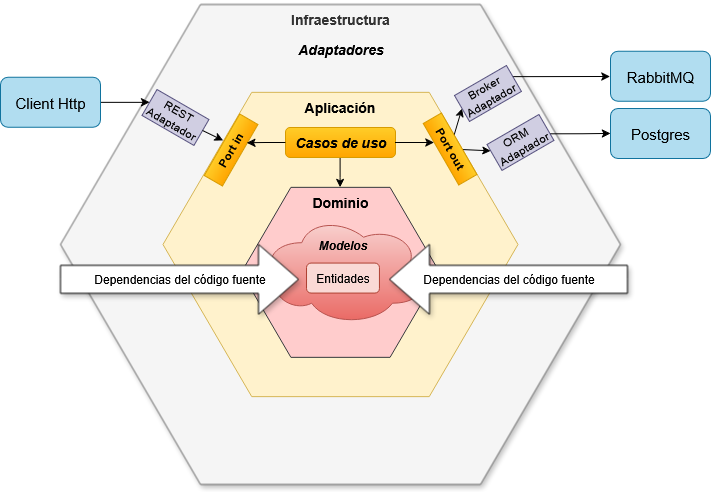
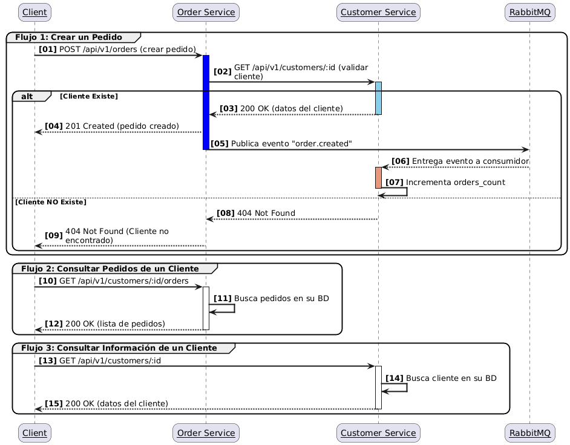

# README

This README would normally document whatever steps are necessary to get the
application up and running.

this project is a simple microservices architecture using Ruby on Rails, PostgreSQL, RabbitMQ, and Docker. It consists of two services: Order Service and Customer Service. The Order Service handles order creation and management, while the Customer Service manages customer information.

was implemented using hexagonal architecture, which promotes separation of concerns and makes the codebase more maintainable and testable.

Things you may want to cover:

* Ruby version (3.4.5)
* Rails version (8.0.4)
* System dependencies PostgreSQL y RabbitMQ
* Configuration
1. Clone the repository
   ```bash
   git clone https://github.com/Great-Side-Projects/monokera-test.git
   cd monokera-test
    ```
* Database creation - Docker compose create database
* Database initialization - Docker compose initialize (seed) the database
1. Customer data seed 
 
    | id | customer_id | customer_name | address | orders_count | created_at | updated_at |
    |----|---------------------|------------|-----------|--------------|----------------------------|----------------------------|
    | 1 | customer@email1.com | Customer 1 | Address 1 | 1 | 2025-09-16 02:08:21.662735 | 2025-09-16 02:08:21.662735 |
    | 2 | customer@email2.com | Customer 2 | Address 2 | 1 | 2025-09-16 02:08:21.688713 | 2025-09-16 02:08:21.688713 |
    | 4 | customer@email4.com | Customer 4 | Address 4 | 1 | 2025-09-16 02:08:21.785043 | 2025-09-16 02:08:21.785043 |
    | 5 | customer@email5.com | Customer 5 | Address 5 | 1 | 2025-09-16 02:08:21.830606 | 2025-09-16 02:08:21.830606 |
    | 6 | customer@email6.com | Customer 6 | Address 6 | 1 | 2025-09-16 02:08:21.861470 | 2025-09-16 02:08:21.861470 |
    | 7 | customer@email7.com | Customer 7 | Address 7 | 1 | 2025-09-16 02:08:21.880939 | 2025-09-16 02:08:21.880939 |
    | 8 | customer@email8.com | Customer 8 | Address 8 | 1 | 2025-09-16 02:08:21.904531 | 2025-09-16 02:08:21.904531 |
    | 9 | customer@email9.com | Customer 9 | Address 9 | 1 | 2025-09-16 02:08:21.927901 | 2025-09-16 02:08:21.927901 |
    | 10 | customer@email10.com| Customer 10| Address 10| 1 | 2025-09-16 02:08:21.944103 | 2025-09-16 02:08:21.944103 |
    | 3 | customer@email3.com | Customer 3 | Address 3 | 1 | 2025-09-16 02:08:21.743892 | 2025-09-16 02:08:21.743892 |

2.  Order data seed
   
    | id | customer_id | product_name | quantity | price | status | created_at | updated_at |
    |----|---------------------|--------------|----------|-------|-----------|----------------------------|----------------------------|
    | 1 | customer@email1.com | Product 1 | 1 | 49.3 | delivered | 2025-09-16 02:34:23.318778 | 2025-09-16 02:34:23.318778 |
    | 2 | customer@email2.com | Product 2 | 3 | 82.14 | pending | 2025-09-16 02:34:23.356614 | 2025-09-16 02:34:23.356614 |
    | 3 | customer@email3.com | Product 3 | 4 | 72.4 | delivered | 2025-09-16 02:34:23.411401 | 2025-09-16 02:34:23.411401 |
    | 4 | customer@email4.com | Product 4 | 4 | 56.72 | shipped | 2025-09-16 02:34:23.440852 | 2025-09-16 02:34:23.440852 |
    | 5 | customer@email5.com | Product 5 | 2 | 91.63 | delivered | 2025-09-16 02:34:23.499355 | 2025-09-16 02:34:23.499355 |
    | 6 | customer@email6.com | Product 6 | 4 | 14.04 | shipped | 2025-09-16 02:34:23.515590 | 2025-09-16 02:34:23.515590 |
    | 7 | customer@email7.com | Product 7 | 5 | 47.67 | pending | 2025-09-16 02:34:23.537586 | 2025-09-16 02:34:23.537586 |
    | 8 | customer@email8.com | Product 8 | 5 | 69.93 | delivered | 2025-09-16 02:34:23.563464 | 2025-09-16 02:34:23.563464 |
    | 9 | customer@email9.com | Product 9 | 5 | 96.2 | shipped | 2025-09-16 02:34:23.588274 | 2025-09-16 02:34:23.588274 |
    | 10 | customer@email10.com| Product 10 | 3 | 57.88 | shipped | 2025-09-16 02:34:23.608109 | 2025-09-16 02:34:23.608109 |
* Deployment instructions
1. Build and run the Docker containers
   ```bash
   docker-compose up
   ```
2. Access the application endpoint
3. Order service endpoint
   ```
   curl --location --request POST 'http://localhost:3001/api/v1/orders' \
    --header 'Content-Type: application/json' \
    --data-raw '{
    "customer_id": "customer@email3.com",
    "product_name": "Laptop prueba hex",
    "quantity": 2,
    "price": "999.83"   
    }'
   ```
   ```
     curl --location --request GET 'http://localhost:3001/api/v1/customer/customer@email3.com/orders'
   ```
4. Customer service endpoint
   ```
    curl --location --request GET 'http://localhost:3000/api/v1/customers/customer@email3.com'    ```
5. Stop the application 
   ```bash
   Press CTRL + C
   ```
   ```
   docker-compose down
   ```
   
* How to run the test suite
1. Run the tests, you need database server running and RabbitMQ server running
2. Order service tests
   ```bash
    cd order-service
    bundle install
    rails db:prepare RAILS_ENV=test
   ```
    ```bash
    rails test
    ```
3. Customer service tests
4. ```bash
    cd customer-service
    bundle install
    rails db:prepare RAILS_ENV=test
   ```
    ```bash
    rails test
    ```
# Diagrams
## Hexagonal architecture
   
# Services communication
   
* The services communicate using RabbitMQ as a message broker. When an order is created in the Order Service, it sends a message to the RabbitMQ queue. The Customer Service listens to this queue and processes the messages to update customer information accordingly.

# Roadmap
* Circuit brakers for inter-service communication http
* Outbox pattern for message reliability
* Dead letter queue for failed messages
* gRPC for inter-service communication
